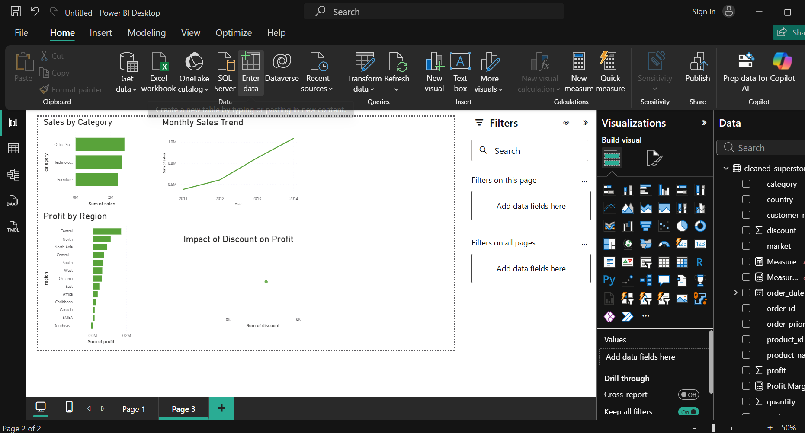

# superstore-sales-analysis
Retail data analysis using Python and Power BI.
Project Overview

This project analyzes retail sales data to evaluate business performance, profitability, and trends across categories, regions, and time.

The dataset was cleaned and processed using Python, and an interactive dashboard was created in Power BI to visualize key insights.

Tools Used
Python (Pandas)
Power BI
Key Insights
-Sales showed a steady growth trend over time.
-Profitability varied across product categories and regions.
-High discount levels were strongly associated with reduced or negative profit.

Challenges Faced
-Handling incorrect data types (dates and numeric values stored as text).
-Fixing errors during data analysis (e.g., datetime conversion issues).
-Learning to design effective and clear dashboards in Power BI.

 Dashboard Features
-Total Sales, Profit, and Profit Margin KPIs.
-Sales by Category.
-Profit by Region.
-Monthly Sales Trend.
-Discount vs Profit Analysis.

Files Included
-Cleaned dataset (CSV).
-Power BI dashboard (.pbix).
-Project screenshots.

Conclusion
This project demonstrates the ability to clean, analyze, and visualize data to generate actionable business insights.

## Dashboard Preview

